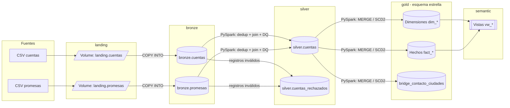
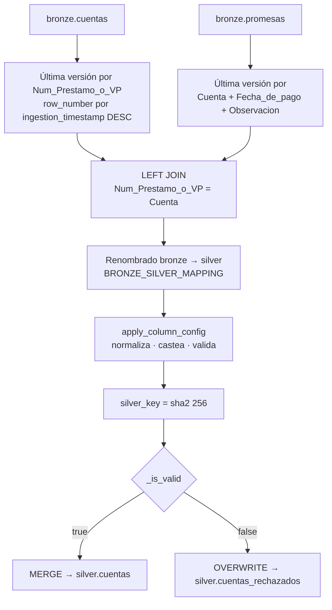
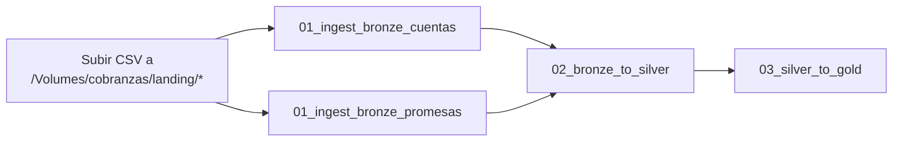

# collections-elt

🌐 [English](README.md) | **Español**

Pipeline ELT en **Databricks** para una agencia de cobranzas, construido sobre **Unity Catalog** y **Delta Lake** con arquitectura **medallion** (Landing → Bronze → Silver → Gold → Semantic).

El proyecto ingiere los archivos CSV operativos de la agencia (cartera de cuentas y promesas de pago), los estandariza y valida con un motor de calidad de datos configurable, y los modela en un **esquema estrella** listo para analítica de recuperación, gestión extrajudicial, gestión judicial y embargos.

---

## Tabla de contenido

- [Arquitectura](#arquitectura)
- [Stack tecnológico](#stack-tecnológico)
- [Estructura del repositorio](#estructura-del-repositorio)
- [Unity Catalog: catálogo, esquemas y volúmenes](#unity-catalog-catálogo-esquemas-y-volúmenes)
- [Capa Bronze](#capa-bronze)
- [Capa Silver](#capa-silver)
- [Capa Gold](#capa-gold)
- [Capa Semantic](#capa-semantic)
- [Dashboard](#dashboard)
- [Orden de ejecución](#orden-de-ejecución)
- [Decisiones de diseño](#decisiones-de-diseño)
- [Consideraciones y mejoras pendientes](#consideraciones-y-mejoras-pendientes)

---

## Arquitectura



| Capa | Esquema | Propósito | Tecnología |
|---|---|---|---|
| Landing | `cobranzas.landing` | Zona de aterrizaje de archivos crudos | UC Volumes |
| Bronze | `cobranzas.bronze` | Copia fiel del origen, todo como `STRING`, con metadatos de ingesta | `COPY INTO` (SQL) |
| Silver | `cobranzas.silver` | Datos limpios, tipados, normalizados y validados; cuarentena de rechazados | PySpark + `MERGE` |
| Gold | `cobranzas.gold` | Modelo dimensional (estrella/copo de nieve) con llaves subrogadas | PySpark + Spark SQL |
| Semantic | `cobranzas.semantic` | Vistas de negocio para BI y reportería | Vistas SQL |

---

## Stack tecnológico

- **Databricks** (notebooks SQL y PySpark)
- **Unity Catalog**: catálogo, esquemas, volúmenes y constraints informativas (PK/FK)
- **Delta Lake**: `MERGE`, `IDENTITY` columns, column defaults, Liquid Clustering, auto-optimize
- **PySpark**: transformaciones, funciones de ventana, validaciones declarativas
- **Spark SQL**: DDL, carga incremental y vistas semánticas

---

## Estructura del repositorio

```
collections-elt/
├── DDL/
│   ├── init_enviroment.ipynb      # Catálogo, esquemas y volúmenes
│   ├── ddl_bronze.ipynb           # Tablas bronze
│   ├── ddl_silver.ipynb           # silver.cuentas + cuarentena
│   └── ddl_gold.ipynb             # Dimensiones, hechos, FKs y clustering
├── ETL/
│   ├── 01_ingest_bronze_cuentas.ipynb    # COPY INTO bronze.cuentas
│   ├── 01_ingest_bronze_promesas.ipynb   # COPY INTO bronze.promesas
│   ├── 02_bronze_to_silver.ipynb         # Limpieza, DQ y MERGE a silver
│   └── 03_silver_to_gold.ipynb           # Carga del modelo dimensional
├── docs/images/                    # Capturas del dashboard
├── views/                          # Vistas de la capa semantic
│   ├── view_clientes_dificil_recuperacion.ipynb
│   ├── view_cuentas_gestionadas_por_gestor.ipynb
│   ├── view_cuentas_judiciales_sin_movimientos.ipynb
│   ├── view_distribucion_cartera_extrajudicial.ipynb
│   ├── view_distribucion_cartera_judicial.ipynb
│   ├── view_estado_embargos.ipynb
│   ├── view_info_clientes.ipynb
│   ├── view_montos_promesas_actual.ipynb
│   ├── view_rendimiento_agentes.ipynb
│   └── view_target_recuperacion_promesas_gestor.ipynb
├── README.md                       # English
└── README.es.md                    # Español
```

---

## Unity Catalog: catálogo, esquemas y volúmenes

`DDL/init_enviroment.ipynb` crea el entorno completo:

```sql
CREATE CATALOG IF NOT EXISTS cobranzas;

CREATE SCHEMA IF NOT EXISTS landing;   -- volúmenes de archivos origen
CREATE SCHEMA IF NOT EXISTS bronze;    -- datos crudos
CREATE SCHEMA IF NOT EXISTS silver;    -- datos limpios y validados
CREATE SCHEMA IF NOT EXISTS gold;      -- modelo dimensional
CREATE SCHEMA IF NOT EXISTS semantic;  -- vistas de negocio

CREATE VOLUME IF NOT EXISTS cobranzas.landing.cuentas;
CREATE VOLUME IF NOT EXISTS cobranzas.landing.promesas;
```

> ⚠️ El notebook inicia con `DROP CATALOG IF EXISTS cobranzas CASCADE`. Está pensado para reconstruir el entorno desde cero; **no debe ejecutarse en un entorno con datos productivos**.

Los archivos fuente se depositan en:

- `/Volumes/cobranzas/landing/cuentas/`
- `/Volumes/cobranzas/landing/promesas/`

---

## Capa Bronze

### Tablas

| Tabla | Descripción |
|---|---|
| `bronze.cuentas` | Cartera de cuentas: responsables, cliente, saldos, producto, datos laborales, gestión extrajudicial, gestión judicial y embargos (~55 columnas de negocio). |
| `bronze.promesas` | Promesas/arreglos de pago por cuenta: montos mensuales en L y USD, fecha de pago, tipo de arreglo, plazo y estado. |

### Características

- **Todas las columnas de negocio son `STRING`**: el dato se conserva sin transformar; el casteo ocurre en silver.
- **Columnas de auditoría** agregadas en la ingesta:
  - `source_file` → `_metadata.file_name`
  - `source_file_modified_at` → `_metadata.file_modification_time`
  - `ingestion_timestamp` → `current_timestamp()`
- `bronze.cuentas` usa `rescuedDataColumn = '_rescued_data'` para capturar columnas o valores que no calzan con el esquema.
- Propiedades Delta: `optimizeWrite` y `autoCompact` habilitados.

### Ingesta incremental

```sql
COPY INTO cobranzas.bronze.cuentas
FROM (
  SELECT *,
         _metadata.file_name              AS source_file,
         _metadata.file_modification_time AS source_file_modified_at,
         current_timestamp()              AS ingestion_timestamp
  FROM '/Volumes/cobranzas/landing/cuentas/'
)
FILEFORMAT = CSV
FORMAT_OPTIONS ('header' = 'true', 'sep' = ',', 'encoding' = 'UTF-8',
                'rescuedDataColumn' = '_rescued_data');
```

`COPY INTO` es **idempotente**: registra los archivos ya cargados y solo procesa archivos nuevos en cada ejecución.

---

## Capa Silver

Notebook: `ETL/02_bronze_to_silver.ipynb`

### Tablas

| Tabla | Grano | Descripción |
|---|---|---|
| `silver.cuentas` | 1 fila por cuenta + promesa | Cuentas combinadas con sus promesas de pago; solo registros válidos y tipados (`DATE`, `DECIMAL(18,2)`, `INT`). |
| `silver.cuentas_rechazados` | 1 fila por registro inválido | Cuarentena: mismas columnas en `STRING` + `_dq_errors ARRAY<STRING>` con el detalle de cada error. |

### Flujo de transformación



1. **Deduplicación**: se toma la foto más reciente de cada cuenta y de cada promesa con `row_number()` sobre `ingestion_timestamp`.
2. **Join**: `LEFT JOIN` de cuentas con promesas; las cuentas sin promesa conservan los campos de promesa en `NULL`.
3. **Renombrado**: `BRONZE_SILVER_MAPPING` traduce los nombres de origen a `snake_case` de negocio (p. ej. `Num_Prestamo_o_VP → numero_de_prestamo_vp`, `Observacion → estado_promesa`).
4. **Normalización, casteo y validación**: motor genérico declarativo (ver abajo).
5. **Llave subrogada**: `silver_key = sha2(numero_de_prestamo_vp || fecha_de_pago_promesa || estado_promesa, 256)`, usando `'NA'` para nulos.
6. **Carga**: los válidos se integran con `MERGE` (upsert por `silver_key`); los rechazados sobrescriben la cuarentena en cada corrida.

### Motor de calidad de datos (`COLUMN_CONFIG`)

Cada columna se describe de forma declarativa en un diccionario. La función `apply_column_config()` recorre la configuración y genera las expresiones Spark correspondientes.

| Clave | Efecto |
|---|---|
| `type` | `string`, `decimal`, `integer` o `date`. Define el parser aplicado. |
| `normalize` | Mapa `valor_canónico → [variantes]`. Se implementa con `F.create_map` como lookup. |
| `case` | Fallback cuando el valor no está en `normalize`: `title` (default, `initcap`), `upper`, `lower` o `none`. |
| `mandatory` | Error si el valor es nulo o no parseable. |
| `minimum` | Error si el valor numérico es menor al mínimo. |
| `allowed_values` | Error si el valor no pertenece al catálogo permitido. |
| `regex_format` | Error si el valor no cumple el patrón (p. ej. email). |

Ejemplo:

```python
"embargo_de": {
    "type": "string",
    "normalize": {
        "Vehiculo": ["Vehículo", "vehiculo", "VEHICULO"],
        "Salario":  ["salario", "SALARIO"],
    },
    "allowed_values": ["Cuenta bancaria", "Propiedad", "Salario", "Vehiculo"],
},
```

**Parsers:**

- **Fechas**: `try_to_timestamp` contra múltiples formatos (`M/d/yyyy`, `MM/dd/yyyy`, `d/M/yyyy`, `dd/MM/yyyy`), resueltos con `coalesce`.
- **Decimales**: limpieza de separadores de miles y validación por regex antes de castear a `DECIMAL(18,2)`.
- **Enteros**: validación por regex antes de castear a `INT`.

Los errores de todas las reglas se acumulan en `_dq_errors` (`array_compact`) y `_is_valid = size(_dq_errors) = 0`. Un registro con al menos un error va completo a cuarentena, con mensajes legibles como:

```
estado_cartera: valor fuera de catalogo -> 'Castigada'
dni: obligatorio y vacio/no parseable
```

**Campos obligatorios:** `jefatura`, `gestor`, `numero_de_prestamo_vp`, `numero_cliente_unico`, `dni`, `nombre`.

**Catálogos validados:** estado de cartera, producto, base laboral, tipo de empresa, bienes inmuebles, códigos de gestión, estado de demanda, embargo de, tipo de arreglo y estado de promesa.

---

## Capa Gold

DDL: `DDL/ddl_gold.ipynb` · Carga: `ETL/03_silver_to_gold.ipynb`

Modelo dimensional tipo **estrella**, con ramificaciones de **copo de nieve** en productos y empresas. Todas las tablas son Delta con llaves subrogadas `BIGINT GENERATED ALWAYS AS IDENTITY`, columnas de auditoría `_created_at` / `_updated_at` con `DEFAULT CURRENT_TIMESTAMP()`, y constraints PK/FK **informativas** (no enforced) en Unity Catalog.

### Diagrama entidad-relación (simplificado)

```mermaid
erDiagram
    dim_clientes ||--o{ fact_cuenta : cliente_id
    dim_responsables_cuenta ||--o{ fact_cuenta : responsables_cuenta_id
    dim_productos ||--o{ fact_cuenta : producto_id
    dim_estados_cartera ||--o{ fact_cuenta : estado_cartera_id
    dim_segmentacion_productos ||--o{ dim_productos : segmento_id
    dim_tipos_producto ||--o{ dim_productos : tipo_id

    dim_bienes_inmuebles ||--o{ dim_clientes : bien_inmueble_id
    dim_clientes ||--o{ dim_contacto_clientes : cliente_id
    dim_contacto_clientes ||--o{ bridge_contacto_ciudades : contacto_cliente_id
    dim_ciudades ||--o{ bridge_contacto_ciudades : ciudad_id

    dim_clientes ||--o| fact_laboral_clientes : cliente_id
    dim_empresas ||--o{ fact_laboral_clientes : empresa_id
    dim_tipos_empresas ||--o{ dim_empresas : tipo_empresa_id

    fact_cuenta ||--o{ fact_promesas : cuenta_id
    dim_tipo_arreglo ||--o{ fact_promesas : tipo_arreglo_id
    dim_estados_promesa ||--o{ fact_promesas : estado_promesa_id

    fact_cuenta ||--o| fact_gestion_cuenta : cuenta_id
    fact_cuenta ||--o{ fact_gestion_detalle : cuenta_id
    dim_caracterizaciones_mensuales ||--o{ fact_gestion_cuenta : caracterizacion_mensual_id
    dim_sub_caracterizaciones ||--o{ fact_gestion_cuenta : sub_caracterizacion_id
    dim_codigos_gestion ||--o{ fact_gestion_cuenta : codigos_gestion_id

    fact_cuenta ||--o| fact_gestion_judicial_cuenta : cuenta_id
    fact_cuenta ||--o{ fact_gestion_judicial_detalle : cuenta_id
    dim_tipos_demanda ||--o{ fact_gestion_judicial_cuenta : tipo_demanda_id
    dim_estados_demanda ||--o{ fact_gestion_judicial_cuenta : estado_demanda_id
    dim_caracterizaciones_judiciales ||--o{ fact_gestion_judicial_cuenta : caracterizacion_judicial_id
    dim_juzgados ||--o{ fact_gestion_judicial_cuenta : juzgado_id
    dim_jueces ||--o{ fact_gestion_judicial_cuenta : juez_id
    dim_ciudades ||--o{ fact_gestion_judicial_cuenta : ciudad_demanda_id

    fact_cuenta ||--o| fact_embargos : cuenta_id
    dim_embargos_de ||--o{ fact_embargos : embargo_de_id
    dim_empresas ||--o{ fact_embargos : empresa_id
```



### Dimensiones

| Tabla | Dominio | Tipo de carga |
|---|---|---|
| `dim_responsables_cuenta` | Jefatura y gestor | Catálogo insert-only (estructura SCD2: `actual`, `fecha_inicio`, `fecha_fin`) |
| `dim_clientes` | Nombre, DNI, número de cliente único | `MERGE` (SCD1) |
| `dim_contacto_clientes` | Email, teléfonos, celular | **SCD2** por `cliente_id` |
| `dim_productos` | Producto → segmento, tipo | `MERGE` (copo de nieve) |
| `dim_segmentacion_productos`, `dim_tipos_producto` | Catálogos de producto | Insert-only |
| `dim_estados_cartera` | Judicial / Extrajudicial / Activa | Insert-only |
| `dim_empresas` | Lugar de trabajo → tipo de empresa | `MERGE` (copo de nieve) |
| `dim_tipos_empresas`, `dim_bienes_inmuebles` | Catálogos laborales y patrimoniales | Insert-only |
| `dim_caracterizaciones_mensuales`, `dim_sub_caracterizaciones`, `dim_codigos_gestion` | Gestión extrajudicial | Insert-only |
| `dim_estados_promesa`, `dim_tipo_arreglo` | Promesas de pago | Insert-only |
| `dim_tipos_demanda`, `dim_estados_demanda`, `dim_caracterizaciones_judiciales`, `dim_juzgados`, `dim_jueces` | Gestión judicial | Insert-only |
| `dim_embargos_de` | Tipo de bien embargado | Insert-only |
| `dim_ciudades` | Ciudades (cuenta y demanda) | Insert-only |
| `bridge_contacto_ciudades` | Relación N:M contacto ↔ ciudades | Insert-only |

### Hechos

| Tabla | Grano | Contenido principal |
|---|---|---|
| `fact_cuenta` | 1 fila por préstamo (`numero_de_prestamo_vp`) | Saldos en L y USD, saldo con honorarios, fechas de asignación, castigo y último pago. Estado **actual** (upsert). |
| `fact_promesas` | 1 fila por cuenta + fecha de pago + estado | Montos mensuales L/USD, plazo, fechas, estado y flag `cumplida`. |
| `fact_laboral_clientes` | 1 fila por cliente | Flag `labora` y empresa. |
| `fact_gestion_cuenta` | 1 fila por cuenta | Snapshot de la gestión extrajudicial: caracterización, sub-caracterización, código de gestión, bitácora y fecha de última gestión. |
| `fact_gestion_detalle` | 1 fila por acción de gestión | Bitácora extrajudicial parseada: `fecha_gestion`, `usuario`, `comentario`. |
| `fact_gestion_judicial_cuenta` | 1 fila por cuenta | Demanda: tipo, estado, juzgado, juez, ciudad, expediente, cuantías y fechas procesales. |
| `fact_gestion_judicial_detalle` | 1 fila por acción judicial | Bitácora judicial parseada. |
| `fact_embargos` | 1 fila por cuenta | Tipo de embargo, fecha, cantidad retenida mensual y empresa retenedora (solo embargos de salario). |

### Motor genérico de carga

`03_silver_to_gold.ipynb` define cuatro funciones reutilizables que cubren todas las cargas:

| Función | Patrón |
|---|---|
| `upsert_catalog(table, key_cols, df, extra_insert_cols)` | Inserta solo combinaciones nuevas mediante `LEFT ANTI JOIN`. Para catálogos y la tabla puente. |
| `merge_dimension_with_attrs(table, key_col, attr_cols, df)` | `MERGE` clásico (update si existe, insert si no) y actualiza `_updated_at`. Para dimensiones con atributos y hechos de estado actual. |
| `scd2_upsert(table, natural_key_col, attr_cols, df)` | SCD Tipo 2: detecta cambios con comparación null-safe (`<=>`), cierra la versión vigente (`actual = false`, `fecha_fin`) e inserta la nueva versión. |
| `attach_id(df, table, key_cols, id_col, source_cols, alias)` | Resuelve llaves subrogadas con un left join null-safe; si la dimensión tiene columna `actual`, filtra automáticamente la versión vigente. |

### Secuencia de carga

1. Dimensiones de catálogo simples (16 dimensiones, definidas en `SIMPLE_DIMS`).
2. Dimensiones con FK: `dim_productos`, `dim_empresas`.
3. `dim_clientes` → `dim_contacto_clientes` (SCD2) → `dim_responsables_cuenta`.
4. `dim_ciudades` y `bridge_contacto_ciudades`: el campo `ciudad` puede contener varias ciudades separadas por `,` o `/`, por lo que se aplica `split` + `explode` + normalización.
5. `fact_cuenta`.
6. `fact_promesas` (MERGE por `cuenta_id` + `fecha_de_pago` + `estado_promesa_id`), `fact_laboral_clientes`, `fact_embargos`.
7. `fact_gestion_cuenta` + `fact_gestion_detalle`.
8. `fact_gestion_judicial_cuenta` + `fact_gestion_judicial_detalle`.

### Parseo de bitácoras de gestión

Los campos `gestion_diaria` y `gestion_judicial_historica` son bloques de texto acumulativos con el formato:

```
// dd/mm/aaaa hh:mm:ss usuario / comentario (categoria). // ...
```

`parse_gestion_log()` los divide por `//`, extrae cada componente con la expresión regular:

```
^(\d{2}/\d{2}/\d{4})\s+(\d{2}:\d{2}:\d{2})\s+(\S+)\s*/\s*(.*?)\s*\(([^()]*)\)\.?\s*$
```

y genera una fila por acción (`cuenta_id`, `fecha_gestion`, `usuario`, `comentario`). `append_detalle_nuevo()` inserta solo las acciones nuevas (anti-join por las cuatro columnas), de modo que la tabla de detalle acumula historial aunque el origen reenvíe el bloque completo en cada carga. La fecha máxima parseada alimenta `fact_gestion_cuenta.fecha_ultima_gestion`.

### Optimización física

Liquid Clustering sobre los hechos de mayor volumen y patrones de consulta más frecuentes:

```sql
ALTER TABLE cobranzas.gold.fact_cuenta                   CLUSTER BY (cliente_id, responsables_cuenta_id);
ALTER TABLE cobranzas.gold.fact_gestion_cuenta           CLUSTER BY (cuenta_id, fecha_ultima_gestion);
ALTER TABLE cobranzas.gold.fact_gestion_detalle          CLUSTER BY (cuenta_id, fecha_gestion);
ALTER TABLE cobranzas.gold.fact_gestion_judicial_cuenta  CLUSTER BY (cuenta_id);
ALTER TABLE cobranzas.gold.fact_gestion_judicial_detalle CLUSTER BY (cuenta_id, fecha_gestion);
```

---

## Capa Semantic

Vistas en `cobranzas.semantic` para consumo desde BI (Databricks SQL, Power BI, etc.).

| Vista | Propósito |
|---|---|
| `vw_info_clientes` | Perfil del cliente: bien inmueble, situación laboral, empresa y tipo de empresa. |
| `vw_clientes_dificil_recuperacion` | Clientes sin empleo registrado (`labora = false`) con su situación patrimonial. |
| `vw_cuentas_gestionadas_por_gestor` | Cuentas con caracterización, sub-caracterización y bitácora por gestor. |
| `vw_distribucion_cartera_judicial` | Saldo total con honorarios por producto, cartera judicial. |
| `vw_distribucion_cartera_extrajudicial` | Saldo total con honorarios por producto, cartera extrajudicial. |
| `vw_cuentas_judiciales_sin_movimientos` | Conteo de cuentas judiciales sin movimiento reciente en el año en curso. |
| `vw_estado_embargos` | Cantidad mensual retenida por tipo de embargo. |
| `vw_montos_promesas_actual` | Total de montos mensuales prometidos (L y USD) del mes en curso. |
| `vw_target_recuperacion_promesas_gestor` | Meta vs. monto recuperado de promesas del mes, por gestor. |
| `vw_rendimiento_agentes` | KPIs por gestor: efectividad, avance de recuperación, promesas rotas y postergaciones. |

### KPIs de `vw_rendimiento_agentes`

| KPI | Fórmula |
|---|---|
| Efectividad | `cumplidas / total_promesas × 100` |
| Avance de recuperaciones | `(total_promesas − pendientes) / total_promesas × 100` |
| Promesas rotas | `incumplidas / (cumplidas + incumplidas) × 100` |
| Postergaciones | `postergadas / total_promesas × 100` |

---

## Dashboard

Dashboard de **Databricks AI/BI** construido sobre las vistas de la capa semantic. Se organiza en tres pestañas.

> ℹ️ Los datos mostrados en las capturas son **sintéticos**, generados para demostración; no corresponden a clientes ni gestores reales.

### Info Cartera

Visión general del portafolio: total de cartera judicial y extrajudicial, cuentas judiciales sin movimientos recientes, distribución del saldo con honorarios por producto, cuentas sin gestión mensual por gestor y distribución de embargos por tipo.


### Promesas

Desempeño de la gestión de promesas de pago por gestor: target de recuperación vs. avance del mes, efectividad, avance de recuperaciones, promesas rotas y tasa de contención.


### Clientes *(en desarrollo)*

Perfil de la base de clientes: clientes de difícil recuperación y clientes que trabajan por tipo de empresa.


---

## Orden de ejecución

### Configuración inicial (una sola vez)

| # | Notebook | Acción |
|---|---|---|
| 1 | `DDL/init_enviroment.ipynb` | Crea catálogo, esquemas y volúmenes |
| 2 | `DDL/ddl_bronze.ipynb` | Crea tablas bronze |
| 3 | `DDL/ddl_silver.ipynb` | Crea `silver.cuentas` y cuarentena |
| 4 | `DDL/ddl_gold.ipynb` | Crea dimensiones, hechos, FKs y clustering |
| 5 | `views/*.ipynb` | Crea las vistas semánticas |

### Pipeline recurrente



Se recomienda orquestar los notebooks de `ETL/` como un **Databricks Job** con tareas dependientes: las dos ingestas bronze en paralelo, seguidas de silver y luego gold.

### Requisitos

- Workspace de Databricks con **Unity Catalog** habilitado.
- Permisos `CREATE CATALOG` (o un catálogo `cobranzas` preasignado), `CREATE SCHEMA`, `CREATE VOLUME` y `CREATE TABLE`.
- Runtime con soporte para `try_to_timestamp`, `array_compact`, columnas `IDENTITY`, column defaults y Liquid Clustering (Databricks Runtime 13.3 LTS o superior recomendado).

---

## Decisiones de diseño

- **Bronze sin tipado**: todo se almacena como `STRING` para no perder información ante errores de formato en origen; la trazabilidad se garantiza con `source_file`, `source_file_modified_at` e `ingestion_timestamp`.
- **Validación declarativa**: las reglas de calidad viven en `COLUMN_CONFIG`, separadas del motor de ejecución. Agregar o ajustar una regla no requiere modificar código de transformación.
- **Cuarentena en lugar de descarte**: los registros inválidos se conservan con el detalle de sus errores para corrección en origen.
- **Normalización con fallback**: los valores no mapeados se estandarizan por capitalización, reduciendo la proliferación de variantes en las dimensiones.
- **Idempotencia**: `COPY INTO` en bronze, `MERGE` en silver y gold, y anti-joins en catálogos y tablas de detalle permiten reejecutar el pipeline sin duplicar datos.
- **SCD2 en datos de contacto**: se conserva el historial de email y teléfonos, útil para trazabilidad de la gestión de cobro.
- **Estado actual vs. historial**: los hechos a nivel cuenta (`fact_cuenta`, `fact_gestion_cuenta`, etc.) guardan el estado vigente; el historial de acciones se preserva en las tablas `*_detalle`.
- **Tabla puente de ciudades**: modela la relación N:M entre un cliente y las ciudades asociadas a sus distintas cuentas.

---

## Consideraciones y mejoras pendientes

- `init_enviroment.ipynb` elimina el catálogo completo (`DROP CATALOG ... CASCADE`); conviene separarlo en un script de reset exclusivo para desarrollo.
- `ddl_gold.ipynb` usa `CREATE TABLE` sin `IF NOT EXISTS`, por lo que no es re-ejecutable sobre un entorno existente.
- `vw_rendimiento_agentes` usa IDs fijos de `estado_promesa_id` (1–4); al ser llaves `IDENTITY`, dependen del orden de inserción. Se recomienda unir con `dim_estados_promesa` y filtrar por descripción.
- `vw_montos_promesas_actual` filtra solo por mes (`month(fecha_de_pago)`), sin año; puede mezclar meses de años distintos.
- `vw_cuentas_judiciales_sin_movimientos` usa meses fijos (7, 8, 9); conviene parametrizarlo relativo a `current_date`.
- `fact_laboral_clientes` guarda solo el estado actual; si se requiere sustentar embargos con historial laboral, puede migrarse a SCD2.
- `bronze.promesas` no usa `rescuedDataColumn`; agregarlo mantendría consistencia con `bronze.cuentas`.
- El diccionario de normalización de ciudades existe en silver y en gold; centralizarlo en un módulo compartido evitaría divergencias.
- Evolución sugerida: migrar a **Auto Loader** o **Delta Live Tables / Lakeflow** con expectations para ingesta en streaming y calidad de datos nativa.
