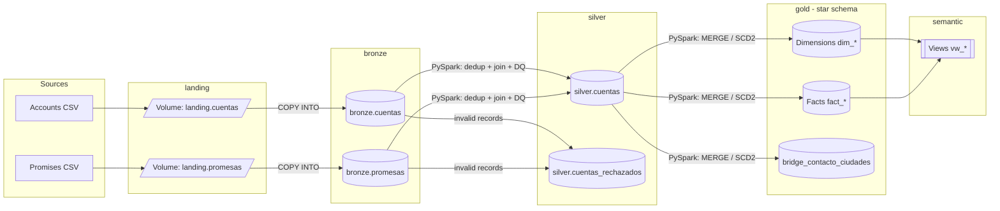
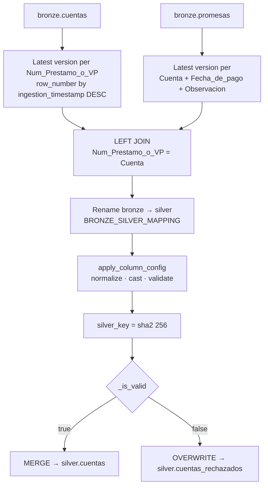
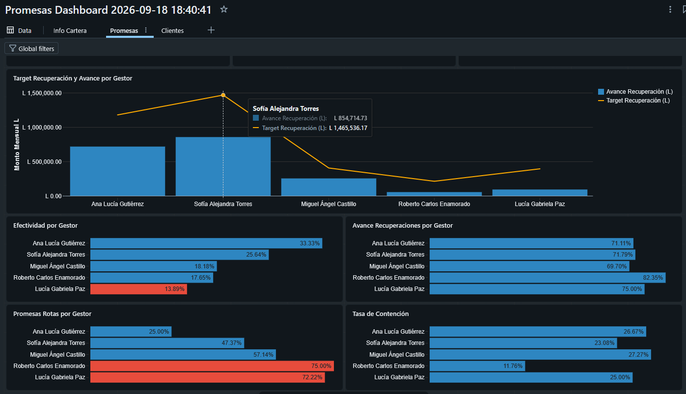
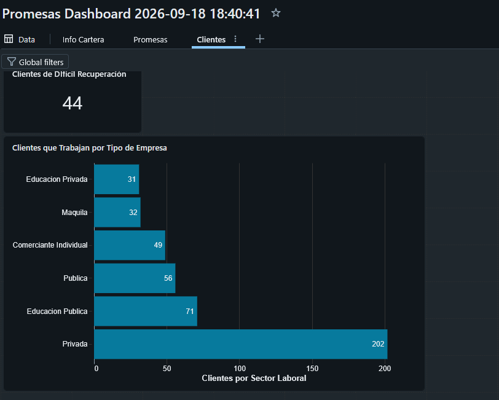
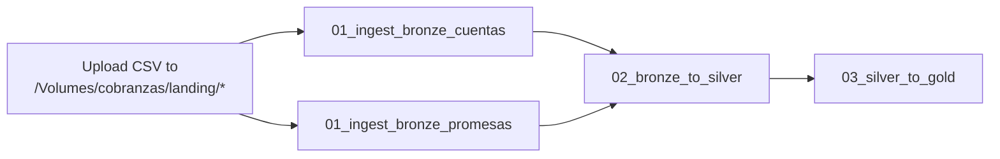

# collections-elt

🌐 **English** | [Español](README.es.md)

ELT pipeline on **Databricks** for a debt collection agency, built on **Unity Catalog** and **Delta Lake** using a **medallion** architecture (Landing → Bronze → Silver → Gold → Semantic).

The project ingests the agency's operational CSV files (account portfolio and payment promises), standardizes and validates them with a configurable data quality engine, and models them into a **star schema** ready for analytics on recovery, out-of-court collections, legal collections and wage/asset attachments.

> Table and column names are kept in Spanish, as defined in the source code and business domain.

---

## Table of contents

- [Architecture](#architecture)
- [Tech stack](#tech-stack)
- [Repository structure](#repository-structure)
- [Unity Catalog: catalog, schemas and volumes](#unity-catalog-catalog-schemas-and-volumes)
- [Bronze layer](#bronze-layer)
- [Silver layer](#silver-layer)
- [Gold layer](#gold-layer)
- [Semantic layer](#semantic-layer)
- [Dashboard](#dashboard)
- [Execution order](#execution-order)
- [Design decisions](#design-decisions)
- [Known issues and improvements](#known-issues-and-improvements)

---

## Architecture



| Layer | Schema | Purpose | Technology |
|---|---|---|---|
| Landing | `cobranzas.landing` | Landing zone for raw files | UC Volumes |
| Bronze | `cobranzas.bronze` | Faithful copy of the source, all `STRING`, with ingestion metadata | `COPY INTO` (SQL) |
| Silver | `cobranzas.silver` | Clean, typed, normalized and validated data; quarantine for rejected records | PySpark + `MERGE` |
| Gold | `cobranzas.gold` | Dimensional model (star/snowflake) with surrogate keys | PySpark + Spark SQL |
| Semantic | `cobranzas.semantic` | Business views for BI and reporting | SQL views |

---

## Tech stack

- **Databricks** (SQL and PySpark notebooks)
- **Unity Catalog**: catalog, schemas, volumes and informational constraints (PK/FK)
- **Delta Lake**: `MERGE`, `IDENTITY` columns, column defaults, Liquid Clustering, auto-optimize
- **PySpark**: transformations, window functions, declarative validations
- **Spark SQL**: DDL, incremental loading and semantic views

---

## Repository structure

```
collections-elt/
├── DDL/
│   ├── init_enviroment.ipynb      # Catalog, schemas and volumes
│   ├── ddl_bronze.ipynb           # Bronze tables
│   ├── ddl_silver.ipynb           # silver.cuentas + quarantine
│   └── ddl_gold.ipynb             # Dimensions, facts, FKs and clustering
├── ETL/
│   ├── 01_ingest_bronze_cuentas.ipynb    # COPY INTO bronze.cuentas
│   ├── 01_ingest_bronze_promesas.ipynb   # COPY INTO bronze.promesas
│   ├── 02_bronze_to_silver.ipynb         # Cleansing, DQ and MERGE into silver
│   └── 03_silver_to_gold.ipynb           # Dimensional model load
├── docs/images/                    # Dashboard screenshots
├── views/                          # Semantic layer views
│   ├── view_clientes_dificil_recuperacion.ipynb
│   ├── view_cuentas_gestionadas_por_gestor.ipynb
│   ├── view_cuentas_judiciales_sin_movimientos.ipynb
│   ├── view_distribucion_cartera_extrajudicial.ipynb
│   ├── view_distribucion_cartera_judicial.ipynb
│   ├── view_estado_embargos.ipynb
│   ├── view_info_clientes.ipynb
│   ├── view_montos_promesas_actual.ipynb
│   ├── view_rendimiento_agentes.ipynb
│   └── view_target_recuperacion_promesas_gestor.ipynb
├── README.md                       # English
└── README.es.md                    # Español
```

---

## Unity Catalog: catalog, schemas and volumes

`DDL/init_enviroment.ipynb` creates the full environment:

```sql
CREATE CATALOG IF NOT EXISTS cobranzas;

CREATE SCHEMA IF NOT EXISTS landing;   -- source file volumes
CREATE SCHEMA IF NOT EXISTS bronze;    -- raw data
CREATE SCHEMA IF NOT EXISTS silver;    -- clean, validated data
CREATE SCHEMA IF NOT EXISTS gold;      -- dimensional model
CREATE SCHEMA IF NOT EXISTS semantic;  -- business views

CREATE VOLUME IF NOT EXISTS cobranzas.landing.cuentas;
CREATE VOLUME IF NOT EXISTS cobranzas.landing.promesas;
```

> ⚠️ The notebook starts with `DROP CATALOG IF EXISTS cobranzas CASCADE`. It is meant to rebuild the environment from scratch; **do not run it against an environment with production data**.

Source files are dropped into:

- `/Volumes/cobranzas/landing/cuentas/`
- `/Volumes/cobranzas/landing/promesas/`

---

## Bronze layer

### Tables

| Table | Description |
|---|---|
| `bronze.cuentas` | Account portfolio: owners, customer, balances, product, employment data, out-of-court collections, legal collections and attachments (~55 business columns). |
| `bronze.promesas` | Payment promises/arrangements per account: monthly amounts in HNL (L) and USD, payment date, arrangement type, term and status. |

### Characteristics

- **All business columns are `STRING`**: data is kept untransformed; casting happens in silver.
- **Audit columns** added at ingestion:
  - `source_file` → `_metadata.file_name`
  - `source_file_modified_at` → `_metadata.file_modification_time`
  - `ingestion_timestamp` → `current_timestamp()`
- `bronze.cuentas` uses `rescuedDataColumn = '_rescued_data'` to capture columns or values that do not match the schema.
- Delta properties: `optimizeWrite` and `autoCompact` enabled.

### Incremental ingestion

```sql
COPY INTO cobranzas.bronze.cuentas
FROM (
  SELECT *,
         _metadata.file_name              AS source_file,
         _metadata.file_modification_time AS source_file_modified_at,
         current_timestamp()              AS ingestion_timestamp
  FROM '/Volumes/cobranzas/landing/cuentas/'
)
FILEFORMAT = CSV
FORMAT_OPTIONS ('header' = 'true', 'sep' = ',', 'encoding' = 'UTF-8',
                'rescuedDataColumn' = '_rescued_data');
```

`COPY INTO` is **idempotent**: it tracks files already loaded and only processes new files on each run.

---

## Silver layer

Notebook: `ETL/02_bronze_to_silver.ipynb`

### Tables

| Table | Grain | Description |
|---|---|---|
| `silver.cuentas` | 1 row per account + promise | Accounts joined with their payment promises; only valid, typed records (`DATE`, `DECIMAL(18,2)`, `INT`). |
| `silver.cuentas_rechazados` | 1 row per invalid record | Quarantine: same columns as `STRING` + `_dq_errors ARRAY<STRING>` detailing each error. |

### Transformation flow



1. **Deduplication**: the most recent snapshot of each account and each promise is selected with `row_number()` over `ingestion_timestamp`.
2. **Join**: `LEFT JOIN` of accounts with promises; accounts without a promise keep promise fields as `NULL`.
3. **Renaming**: `BRONZE_SILVER_MAPPING` maps source names to business `snake_case` (e.g. `Num_Prestamo_o_VP → numero_de_prestamo_vp`, `Observacion → estado_promesa`).
4. **Normalization, casting and validation**: generic declarative engine (see below).
5. **Surrogate key**: `silver_key = sha2(numero_de_prestamo_vp || fecha_de_pago_promesa || estado_promesa, 256)`, using `'NA'` for nulls.
6. **Load**: valid records are merged with `MERGE` (upsert on `silver_key`); rejected records overwrite the quarantine table on each run.

### Data quality engine (`COLUMN_CONFIG`)

Each column is described declaratively in a dictionary. The `apply_column_config()` function walks the configuration and generates the corresponding Spark expressions.

| Key | Effect |
|---|---|
| `type` | `string`, `decimal`, `integer` or `date`. Defines the parser applied. |
| `normalize` | Map `canonical_value → [variants]`. Implemented as a lookup with `F.create_map`. |
| `case` | Fallback when the value is not in `normalize`: `title` (default, `initcap`), `upper`, `lower` or `none`. |
| `mandatory` | Error if the value is null or cannot be parsed. |
| `minimum` | Error if the numeric value is below the minimum. |
| `allowed_values` | Error if the value is not in the allowed catalog. |
| `regex_format` | Error if the value does not match the pattern (e.g. email). |

Example:

```python
"embargo_de": {
    "type": "string",
    "normalize": {
        "Vehiculo": ["Vehículo", "vehiculo", "VEHICULO"],
        "Salario":  ["salario", "SALARIO"],
    },
    "allowed_values": ["Cuenta bancaria", "Propiedad", "Salario", "Vehiculo"],
},
```

**Parsers:**

- **Dates**: `try_to_timestamp` against multiple formats (`M/d/yyyy`, `MM/dd/yyyy`, `d/M/yyyy`, `dd/MM/yyyy`), resolved with `coalesce`.
- **Decimals**: thousands-separator cleanup and regex validation before casting to `DECIMAL(18,2)`.
- **Integers**: regex validation before casting to `INT`.

Errors from all rules are accumulated in `_dq_errors` (`array_compact`) and `_is_valid = size(_dq_errors) = 0`. A record with at least one error goes entirely to quarantine, with readable messages such as:

```
estado_cartera: valor fuera de catalogo -> 'Castigada'
dni: obligatorio y vacio/no parseable
```

**Mandatory fields:** `jefatura`, `gestor`, `numero_de_prestamo_vp`, `numero_cliente_unico`, `dni`, `nombre`.

**Validated catalogs:** portfolio status, product, employment flag, company type, real estate ownership, action codes, lawsuit status, attachment type, arrangement type and promise status.

---

## Gold layer

DDL: `DDL/ddl_gold.ipynb` · Load: `ETL/03_silver_to_gold.ipynb`

**Star schema** dimensional model, with **snowflake** branches for products and companies. All tables are Delta with `BIGINT GENERATED ALWAYS AS IDENTITY` surrogate keys, `_created_at` / `_updated_at` audit columns with `DEFAULT CURRENT_TIMESTAMP()`, and **informational** (not enforced) PK/FK constraints in Unity Catalog.

### Entity-relationship diagram (simplified)

```mermaid
erDiagram
    dim_clientes ||--o{ fact_cuenta : cliente_id
    dim_responsables_cuenta ||--o{ fact_cuenta : responsables_cuenta_id
    dim_productos ||--o{ fact_cuenta : producto_id
    dim_estados_cartera ||--o{ fact_cuenta : estado_cartera_id
    dim_segmentacion_productos ||--o{ dim_productos : segmento_id
    dim_tipos_producto ||--o{ dim_productos : tipo_id

    dim_bienes_inmuebles ||--o{ dim_clientes : bien_inmueble_id
    dim_clientes ||--o{ dim_contacto_clientes : cliente_id
    dim_contacto_clientes ||--o{ bridge_contacto_ciudades : contacto_cliente_id
    dim_ciudades ||--o{ bridge_contacto_ciudades : ciudad_id

    dim_clientes ||--o| fact_laboral_clientes : cliente_id
    dim_empresas ||--o{ fact_laboral_clientes : empresa_id
    dim_tipos_empresas ||--o{ dim_empresas : tipo_empresa_id

    fact_cuenta ||--o{ fact_promesas : cuenta_id
    dim_tipo_arreglo ||--o{ fact_promesas : tipo_arreglo_id
    dim_estados_promesa ||--o{ fact_promesas : estado_promesa_id

    fact_cuenta ||--o| fact_gestion_cuenta : cuenta_id
    fact_cuenta ||--o{ fact_gestion_detalle : cuenta_id
    dim_caracterizaciones_mensuales ||--o{ fact_gestion_cuenta : caracterizacion_mensual_id
    dim_sub_caracterizaciones ||--o{ fact_gestion_cuenta : sub_caracterizacion_id
    dim_codigos_gestion ||--o{ fact_gestion_cuenta : codigos_gestion_id

    fact_cuenta ||--o| fact_gestion_judicial_cuenta : cuenta_id
    fact_cuenta ||--o{ fact_gestion_judicial_detalle : cuenta_id
    dim_tipos_demanda ||--o{ fact_gestion_judicial_cuenta : tipo_demanda_id
    dim_estados_demanda ||--o{ fact_gestion_judicial_cuenta : estado_demanda_id
    dim_caracterizaciones_judiciales ||--o{ fact_gestion_judicial_cuenta : caracterizacion_judicial_id
    dim_juzgados ||--o{ fact_gestion_judicial_cuenta : juzgado_id
    dim_jueces ||--o{ fact_gestion_judicial_cuenta : juez_id
    dim_ciudades ||--o{ fact_gestion_judicial_cuenta : ciudad_demanda_id

    fact_cuenta ||--o| fact_embargos : cuenta_id
    dim_embargos_de ||--o{ fact_embargos : embargo_de_id
    dim_empresas ||--o{ fact_embargos : empresa_id
```



### Dimensions

| Table | Domain | Load type |
|---|---|---|
| `dim_responsables_cuenta` | Account manager and collections officer | Insert-only catalog (SCD2 structure: `actual`, `fecha_inicio`, `fecha_fin`) |
| `dim_clientes` | Name, national ID, unique customer number | `MERGE` (SCD1) |
| `dim_contacto_clientes` | Email, phone numbers, mobile | **SCD2** on `cliente_id` |
| `dim_productos` | Product → segment, type | `MERGE` (snowflake) |
| `dim_segmentacion_productos`, `dim_tipos_producto` | Product catalogs | Insert-only |
| `dim_estados_cartera` | Judicial / Extrajudicial / Activa | Insert-only |
| `dim_empresas` | Workplace → company type | `MERGE` (snowflake) |
| `dim_tipos_empresas`, `dim_bienes_inmuebles` | Employment and property catalogs | Insert-only |
| `dim_caracterizaciones_mensuales`, `dim_sub_caracterizaciones`, `dim_codigos_gestion` | Out-of-court collections | Insert-only |
| `dim_estados_promesa`, `dim_tipo_arreglo` | Payment promises | Insert-only |
| `dim_tipos_demanda`, `dim_estados_demanda`, `dim_caracterizaciones_judiciales`, `dim_juzgados`, `dim_jueces` | Legal collections | Insert-only |
| `dim_embargos_de` | Type of attached asset | Insert-only |
| `dim_ciudades` | Cities (account and lawsuit) | Insert-only |
| `bridge_contacto_ciudades` | N:M relationship contact ↔ cities | Insert-only |

### Facts

| Table | Grain | Main content |
|---|---|---|
| `fact_cuenta` | 1 row per loan (`numero_de_prestamo_vp`) | Balances in HNL and USD, balance including fees, assignment, charge-off and last payment dates. **Current** state (upsert). |
| `fact_promesas` | 1 row per account + payment date + status | Monthly amounts HNL/USD, term, dates, status and `cumplida` flag. |
| `fact_laboral_clientes` | 1 row per customer | `labora` flag and employer. |
| `fact_gestion_cuenta` | 1 row per account | Out-of-court collections snapshot: characterization, sub-characterization, action code, activity log and last action date. |
| `fact_gestion_detalle` | 1 row per collection action | Parsed out-of-court log: `fecha_gestion`, `usuario`, `comentario`. |
| `fact_gestion_judicial_cuenta` | 1 row per account | Lawsuit: type, status, court, judge, city, case number, amounts claimed and procedural dates. |
| `fact_gestion_judicial_detalle` | 1 row per legal action | Parsed legal log. |
| `fact_embargos` | 1 row per account | Attachment type, date, monthly withheld amount and withholding employer (wage attachments only). |

### Generic load engine

`03_silver_to_gold.ipynb` defines four reusable functions that cover every load:

| Function | Pattern |
|---|---|
| `upsert_catalog(table, key_cols, df, extra_insert_cols)` | Inserts only new combinations via `LEFT ANTI JOIN`. Used for catalogs and the bridge table. |
| `merge_dimension_with_attrs(table, key_col, attr_cols, df)` | Classic `MERGE` (update if exists, insert otherwise) and refreshes `_updated_at`. Used for dimensions with attributes and current-state facts. |
| `scd2_upsert(table, natural_key_col, attr_cols, df)` | SCD Type 2: detects changes with null-safe comparison (`<=>`), closes the current version (`actual = false`, `fecha_fin`) and inserts the new version. |
| `attach_id(df, table, key_cols, id_col, source_cols, alias)` | Resolves surrogate keys with a null-safe left join; if the dimension has an `actual` column, it automatically filters to the current version. |

### Load sequence

1. Simple catalog dimensions (16 dimensions, defined in `SIMPLE_DIMS`).
2. Dimensions with FKs: `dim_productos`, `dim_empresas`.
3. `dim_clientes` → `dim_contacto_clientes` (SCD2) → `dim_responsables_cuenta`.
4. `dim_ciudades` and `bridge_contacto_ciudades`: the `ciudad` field may contain several cities separated by `,` or `/`, so `split` + `explode` + normalization is applied.
5. `fact_cuenta`.
6. `fact_promesas` (MERGE on `cuenta_id` + `fecha_de_pago` + `estado_promesa_id`), `fact_laboral_clientes`, `fact_embargos`.
7. `fact_gestion_cuenta` + `fact_gestion_detalle`.
8. `fact_gestion_judicial_cuenta` + `fact_gestion_judicial_detalle`.

### Activity log parsing

The `gestion_diaria` and `gestion_judicial_historica` fields are cumulative text blocks with the format:

```
// dd/mm/yyyy hh:mm:ss user / comment (category). // ...
```

`parse_gestion_log()` splits them on `//`, extracts each component with the regular expression:

```
^(\d{2}/\d{2}/\d{4})\s+(\d{2}:\d{2}:\d{2})\s+(\S+)\s*/\s*(.*?)\s*\(([^()]*)\)\.?\s*$
```

and produces one row per action (`cuenta_id`, `fecha_gestion`, `usuario`, `comentario`). `append_detalle_nuevo()` inserts only new actions (anti-join on the four columns), so the detail table accumulates history even though the source resends the full block on every load. The latest parsed date feeds `fact_gestion_cuenta.fecha_ultima_gestion`.

### Physical optimization

Liquid Clustering on the highest-volume facts and most frequent query patterns:

```sql
ALTER TABLE cobranzas.gold.fact_cuenta                   CLUSTER BY (cliente_id, responsables_cuenta_id);
ALTER TABLE cobranzas.gold.fact_gestion_cuenta           CLUSTER BY (cuenta_id, fecha_ultima_gestion);
ALTER TABLE cobranzas.gold.fact_gestion_detalle          CLUSTER BY (cuenta_id, fecha_gestion);
ALTER TABLE cobranzas.gold.fact_gestion_judicial_cuenta  CLUSTER BY (cuenta_id);
ALTER TABLE cobranzas.gold.fact_gestion_judicial_detalle CLUSTER BY (cuenta_id, fecha_gestion);
```

---

## Semantic layer

Views in `cobranzas.semantic` for BI consumption (Databricks SQL, Power BI, etc.).

| View | Purpose |
|---|---|
| `vw_info_clientes` | Customer profile: real estate ownership, employment status, employer and company type. |
| `vw_clientes_dificil_recuperacion` | Customers with no registered employment (`labora = false`) and their property status. |
| `vw_cuentas_gestionadas_por_gestor` | Accounts with characterization, sub-characterization and activity log per collections officer. |
| `vw_distribucion_cartera_judicial` | Total balance including fees by product, legal portfolio. |
| `vw_distribucion_cartera_extrajudicial` | Total balance including fees by product, out-of-court portfolio. |
| `vw_cuentas_judiciales_sin_movimientos` | Count of legal accounts with no recent activity in the current year. |
| `vw_estado_embargos` | Monthly withheld amount by attachment type. |
| `vw_montos_promesas_actual` | Total promised monthly amounts (HNL and USD) for the current month. |
| `vw_target_recuperacion_promesas_gestor` | Target vs. recovered amount from the month's promises, per collections officer. |
| `vw_rendimiento_agentes` | KPIs per collections officer: effectiveness, recovery progress, broken promises and postponements. |

### `vw_rendimiento_agentes` KPIs

| KPI | Formula |
|---|---|
| Effectiveness (`Efectividad`) | `cumplidas / total_promesas × 100` |
| Recovery progress (`Avance_Recuperaciones`) | `(total_promesas − pendientes) / total_promesas × 100` |
| Broken promises (`Promesas_Rotas`) | `incumplidas / (cumplidas + incumplidas) × 100` |
| Postponements (`Postergaciones`) | `postergadas / total_promesas × 100` |

---

## Dashboard

**Databricks AI/BI** dashboard built on top of the semantic layer views. It is organized into three tabs.

> ℹ️ The data shown in the screenshots is **synthetic**, generated for demonstration purposes; it does not correspond to real customers or collections officers.

### Portfolio overview (Info Cartera)

Portfolio overview: total legal and out-of-court portfolio, legal accounts with no recent activity, balance including fees by product, accounts with no monthly collection activity per collections officer, and attachments by type.


### Promises (Promesas)

Payment promise performance per collections officer: recovery target vs. month-to-date progress, effectiveness, recovery progress, broken promises and retention rate.



### Customers (Clientes) *(in progress)*

Customer base profile: hard-to-recover customers and employed customers by company type.



---

## Execution order

### Initial setup (one time)

| # | Notebook | Action |
|---|---|---|
| 1 | `DDL/init_enviroment.ipynb` | Creates catalog, schemas and volumes |
| 2 | `DDL/ddl_bronze.ipynb` | Creates bronze tables |
| 3 | `DDL/ddl_silver.ipynb` | Creates `silver.cuentas` and quarantine |
| 4 | `DDL/ddl_gold.ipynb` | Creates dimensions, facts, FKs and clustering |
| 5 | `views/*.ipynb` | Creates semantic views |

### Recurring pipeline



It is recommended to orchestrate the `ETL/` notebooks as a **Databricks Job** with dependent tasks: both bronze ingestions in parallel, followed by silver and then gold.

### Requirements

- Databricks workspace with **Unity Catalog** enabled.
- `CREATE CATALOG` privilege (or a pre-assigned `cobranzas` catalog), `CREATE SCHEMA`, `CREATE VOLUME` and `CREATE TABLE`.
- Runtime supporting `try_to_timestamp`, `array_compact`, `IDENTITY` columns, column defaults and Liquid Clustering (Databricks Runtime 13.3 LTS or later recommended).

---

## Design decisions

- **Untyped bronze**: everything is stored as `STRING` to avoid losing information when the source has format errors; traceability is ensured by `source_file`, `source_file_modified_at` and `ingestion_timestamp`.
- **Declarative validation**: data quality rules live in `COLUMN_CONFIG`, separate from the execution engine. Adding or adjusting a rule does not require changing transformation code.
- **Quarantine instead of discarding**: invalid records are kept with their error details so they can be fixed at the source.
- **Normalization with fallback**: unmapped values are standardized by capitalization, reducing the proliferation of variants in dimensions.
- **Idempotency**: `COPY INTO` in bronze, `MERGE` in silver and gold, and anti-joins in catalogs and detail tables allow the pipeline to be re-run without duplicating data.
- **SCD2 for contact data**: email and phone history is preserved, which supports traceability of collection efforts.
- **Current state vs. history**: account-level facts (`fact_cuenta`, `fact_gestion_cuenta`, etc.) hold the current state; action history is preserved in the `*_detalle` tables.
- **City bridge table**: models the N:M relationship between a customer and the cities associated with their different accounts.

---

## Known issues and improvements

- `init_enviroment.ipynb` drops the whole catalog (`DROP CATALOG ... CASCADE`); it should be split into a development-only reset script.
- `ddl_gold.ipynb` uses `CREATE TABLE` without `IF NOT EXISTS`, so it cannot be re-run on an existing environment.
- `vw_rendimiento_agentes` uses hardcoded `estado_promesa_id` values (1–4); since they are `IDENTITY` keys, they depend on insertion order. Joining with `dim_estados_promesa` and filtering by description is recommended.
- `vw_montos_promesas_actual` filters by month only (`month(fecha_de_pago)`), without year; it can mix the same month from different years.
- `vw_cuentas_judiciales_sin_movimientos` uses fixed months (7, 8, 9); it should be parameterized relative to `current_date`.
- `fact_laboral_clientes` stores only the current state; if employment history is needed to support attachments, it can be migrated to SCD2.
- `bronze.promesas` does not use `rescuedDataColumn`; adding it would keep it consistent with `bronze.cuentas`.
- The city normalization dictionary exists in both silver and gold; centralizing it in a shared module would prevent drift.
- Suggested evolution: migrate to **Auto Loader** or **Delta Live Tables / Lakeflow** with expectations for streaming ingestion and native data quality.
